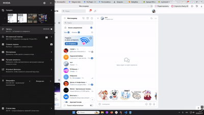

# Нейроботы для телеграмма и Вконтакте для ответов на часто задаваемые вопросы

Данные боты выполняют функцию помощников, для ответов на часто задаваемые вопросы. В случае неопознанных сообщений, боты передают сообщение пользователя в техподдержку

- Рабочая версия бота во Вконтакте: [vk.ru/club237933972](https://vk.ru/club237933972)

## Как боты были обучены

Боты учились через сервис DialogFlow
Вся логика ответов хранится **не в коде**, а в самом Dialogflow — в виде **интентов**.

## Что такое интент и откуда бот взял ответы

**Интент** — это «намерение» пользователя. Например:

- Пользователь пишет «Привет» → срабатывает интент `Приветствие`.
- Пользователь пишет «Как устроиться к вам? » → срабатывает интент `Устройство на работу`.

Через файл `load_intents.py` Бот взял часто задаваемые вопросы из файла `answers.json` и научился на них отвечать
Программа читает json файл, передает это дело функции create_intent.py, функция отправляет это все дело на DialogFlow и все.

## Зависимости 
- `google-cloud-dialogflow==2.51.0`
- `python-dotenv==1.2.3`
- `vk_api==11.10.1`
- `requests==2.34.2`
- `pyTelegramBotAPI==4.37.0`

## Переменные окружения

- **`VK_GROUP_TOKEN`** — токен сообщества ВК. Получить: сообщество → Управление → Работа с API → создать ключ с правами `messages` и `manage`, включить Long Poll API.
- **`GOOGLE_PROJECT_ID`** — ID проекта в Google Cloud. Получить: Dialogflow → Settings (⚙️) → General → скопировать Project ID.
- **`GOOGLE_APPLICATION_CREDENTIALS`** — путь к JSON-ключу сервисного аккаунта. Получить: Google Cloud Console → IAM & Admin → Service Accounts → создать аккаунт с ролью Dialogflow API Client (или Admin) → вкладка Keys → Add key → Create new key → JSON. Скачанный файл положить в проект, в переменной указать путь.
- **`TG_TOKEN`** — токен Telegram-бота. Получить: Telegram → @BotFather → `/newbot` → задать имя и username → скопировать токен.

- После получения всех токенов, необходимо их записать. Для этого откройте файл .env и запишите их в таком виде: VK_GROUP_TOKEN=Ваш_Токен

  ## Установка и запуск 

  python 3.10+ уже должен быть установлен на вашем компьютере.
  1. Скачиваем репозиторий, открываем его в редакторе кода, далее открываем терминал и пишем:
  2. `pip install -r requirements.txt` Команда установит все зависимости из файла requirements.txt
  3. Так же открываем терминал и запускаем:
  - Для Вконтакте: `python vk_group_bot.py`
  - Для Телеграмма: `python telegram_bot.py`

  

  

  
